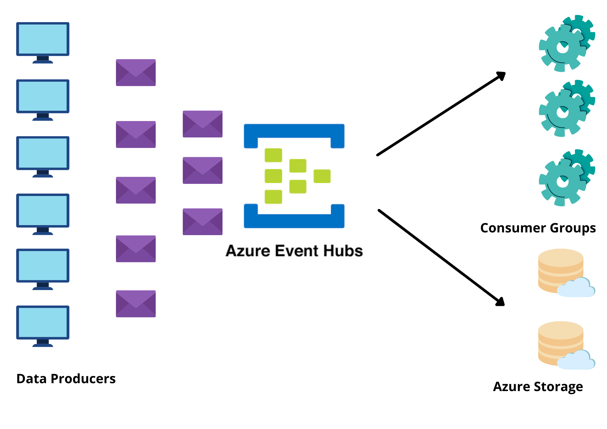
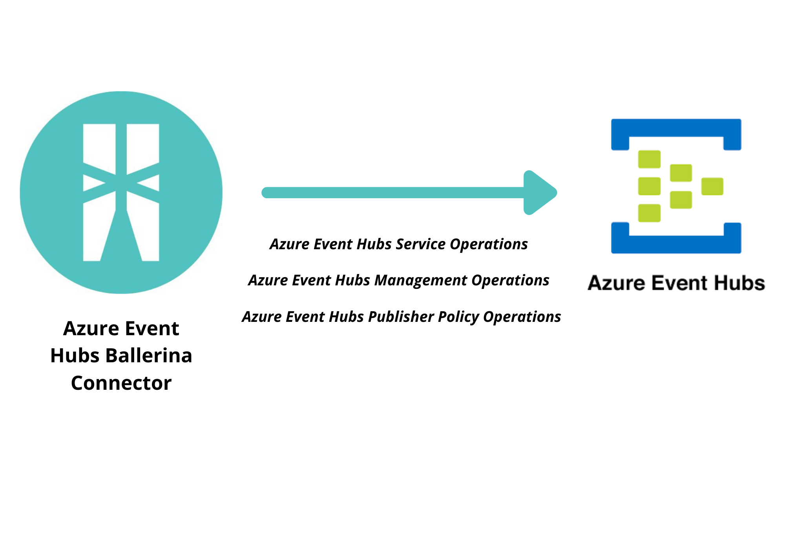

# Ballerina Azure Event Hubs Connector

[](https://github.com/ballerina-platform/module-ballerinax-azure.eventhub/actions?query=workflow%3ACI)
[](https://github.com/ballerina-platform/module-ballerinax-azure.eventhub/commits/slbeta3)
[](https://opensource.org/licenses/Apache-2.0)

Connects to Microsoft Azure Event Hubs using Ballerina.

# Introduction

## What is Azure Event Hub?

[Azure Event Hubs](https://docs.microsoft.com/en-us/azure/event-hubs/event-hubs-about) is a fully managed, real-time 
data ingress service which is highly scalable, secured, open and reliable that ingests data (events) from a variety of 
sources and reliably distribute between multiple independent 
systems for processing, storage and analysis. Azure Event Hubs streamline the data pipelines so that the journey from 
inputs to insights is seamless.  It makes sure all the incoming data is received reliably, fast, in order and is 
available for consumption by many processing systems at their own pace. It automatically decouples event producers from 
event consumers untangling the system architecture. With the elastic scale, event hubs have the durability to handle 
massive amounts of data across various types, sizes and speeds. Event hub integrates with other azure services 
to unlock insights. 

## Key Features of Azure Event Hub

* Ingest millions of events per second from hundreds of thousands of sources with low latency and configurable 
  time retention.
* Enable real time and micro batch processing concurrently.
* Handle massive amounts of data across various types, sizes and speeds with elastic scale.
* Easily connect with Apache Kafka ecosystem
* Natively connect with [Stream Analytics](https://azure.microsoft.com/en-us/services/stream-analytics/) to build an 
end-to-end serverless streaming solution.



## Connector Overview

Azure Event Hubs Ballerina Connector is used to connect with the Azure Event Hubs to ingest millions of events per 
second so that you can process and analyze the massive amounts of data produced by your connected devices and 
applications. Once data is collected into an Event Hub, it can be transformed and stored using any real-time 
analytics provider or batching/storage adapters.

Azure Event Hub Ballerina connector supports Event hub service operations like sending an event, sending batch events, 
sending partition events and sending events with partition ID. It also supports Event hub management operations like 
creating a new event hub, getting an event hub, updating an event hub, listing event hubs, deleting event hubs, 
creating a new consumer group, getting consumer groups, listing consumer groups, listing partitions, getting partitions, 
deleting consumer groups. The connector also provides the capability to handle publisher policy operations like getting 
revoked publishers, revoking a publisher, and resume publishers.



The connector will only be focusing on sending events to the event hub. The event hub connector will invoke the 
REST APIs exposed via the Azure Event Hub. https://docs.microsoft.com/en-us/rest/api/eventhub/.

The REST APIs fall into the following categories:
* Azure Resource Manager: APIs that perform resource manager operations, and have /providers/Microsoft.EventHub/ as part 
  of the request URI.
* Event Hubs service: APIs that enable operations directly on the Event Hubs service, and have 
  <namespace>.servicebus.windows.net/ in the request URI. The Event Hubs service API is focused on this implementation.

# Prerequisites

* Azure Account to Access Azure Portal https://docs.microsoft.com/en-us/learn/modules/create-an-azure-account/

* A Resource Group https://docs.microsoft.com/en-us/azure/event-hubs/event-hubs-create#create-a-resource-group

* An Event Hubs Namespace https://docs.microsoft.com/en-us/azure/event-hubs/event-hubs-create#create-an-event-hubs-namespace

* An Event Hub https://docs.microsoft.com/en-us/azure/event-hubs/event-hubs-create#create-an-event-hub

* Java 11 Installed
Java Development Kit (JDK) with version 11 is required.

* Ballerina SLAlpha5 Installed
Ballerina Swan Lake Beta 3 is required. 

* Connection String of the Event Hub Namespace
We need management credentials to communicate with the Event Hubs. These credentials are available in the connection 
string of the Event Hub namespace. Obtain the connection string for the Event Hubs namespace by following the 
instructions given below.
https://docs.microsoft.com/en-us/azure/event-hubs/event-hubs-get-connection-string#get-connection-string-from-the-portal

* Shared Access Signature (SAS) Authentication Credentials
You need to extract the Shared Access Key Name, Shared Access Key, Resource URI to the Event Hub Namespace separately 
from the connection string.
    * Shared Access Key Name, 
    * Shared Access Key, 
    * Resource URI to the Event Hub Namespace.

# Supported Versions & Limitations

## Supported Versions

|                                   | Version               |
|:---------------------------------:|:---------------------:|
| Azure Event Hubs REST API Version | 2014-12               |
| Ballerina Language                | Swan-Lake-Alpha5      |
| Java Development Kit (JDK)        | 11                    |

## Limitations

The connector doesn't support RDFE Rest APIs: APIs that provide programmatic access to much of the functionality 
available through the Azure portal.

# Quickstart(s)

## Publish Events to an Azure Event Hub 

This is the simplest scenario to send events to an Azure Event Hub. You need to obtain a connection string of the 
name space of the event hub you want to send events. You must have the following prerequisites in order to obtain 
these configurations.

* Azure Account to Access Azure Portal https://docs.microsoft.com/en-us/learn/modules/create-an-azure-account/

* A Resource Group https://docs.microsoft.com/en-us/azure/event-hubs/event-hubs-create#create-a-resource-group

* An Event Hub Namespace https://docs.microsoft.com/en-us/azure/event-hubs/event-hubs-create#create-an-event-hubs-namespace

* An Event Hub https://docs.microsoft.com/en-us/azure/event-hubs/event-hubs-create#create-an-event-hub

* Connection String of the Event Hub Namespace.
[Get the connection string](https://docs.microsoft.com/en-us/azure/event-hubs/event-hubs-get-connection-string#get-connection-string-from-the-portal) from the Azure Event Hub namespace you created.

* You need to extract the Shared Access Key Name, Shared Access Key, Resource URI to the Event Hub Namespace separately 
from the connection string.
    * Shared Access Key Name, 
    * Shared Access Key, 
    * Resource URI to the Event Hub Namespace.

### Step 1: Import the Azure Event Hub Ballerina Library
First, import the ballerinax/azure_eventhub module into the Ballerina project.
```ballerina
    import ballerinax/azure_eventhub;
```

### Step 2: Initialize the Azure Event Hub PublisherClient
You can now make the connection configuration using the shared access key name, shared access key, and the resource 
URI to the event hub namespace.
```ballerina
    configurable string sasKeyName = ?;
    configurable string sasKey = ?;
    configurable string resourceUri = ?;

    azure_eventhub:ClientEndpointConfiguration config = {
        sasKeyName: sasKeyName,
        sasKey: sasKey,
        resourceUri: resourceUri 
    };
    azure_eventhub:Client publisherClient = checkpanic new (config);
```
Note:
You must specify the SAS key name, SAS key and the resource URI when configuring the Azure Event Hub Client connector.

### Step 3: Specify the (Optional) Broker Properties and User Properties
You can now define the optional broker properties and user properties to be sent with the event using a map.
```ballerina
    map<string> brokerProps = {CorrelationId: "34", CorrelationId2: "83"};
    map<string> userProps = {Alert: "windy", warning: "true"};
```

### Step 4: Send an event to the Azure Event Hub
You can now send an event to the Azure event hub by giving the event hub name, and the event hub data with the broker 
properties and user properties. You can also give a partition key to send events to the same partition with the given 
partition key name. Here we have sent an event with the string data “eventData” to the event hub named “mytesthub” with 
the partition key “groupName”.
```ballerina
    var sendResult = publisherClient->send("mytesthub", "eventData", userProps, brokerProps, partitionKey = "groupName");
    if (sendResult is error) {
            log:printError(sendResult.message());
    } else {
            log:printInfo("Successfully Send Event to Event Hub!");
    }
```
Note:
You can specify the event hub path and the event data as parameters of the send method.
This operation will return a ballerina error if the operation failed.


## Entity Management in an Azure Event Hub 
This is the simplest scenario to manage entities related to azure event hubs. You need to obtain a connection string of 
the name space of the event hub you want to send events. You must have the following prerequisites in order to obtain 
these configurations.

* Azure Account to Access Azure Portal https://docs.microsoft.com/en-us/learn/modules/create-an-azure-account/

* A Resource Group https://docs.microsoft.com/en-us/azure/event-hubs/event-hubs-create#create-a-resource-group

* An Event Hub Namespace https://docs.microsoft.com/en-us/azure/event-hubs/event-hubs-create#create-an-event-hubs-namespace

* An Event Hub https://docs.microsoft.com/en-us/azure/event-hubs/event-hubs-create#create-an-event-hub

* Connection String of the Event Hub Namespace.
[Get the connection string](https://docs.microsoft.com/en-us/azure/event-hubs/event-hubs-get-connection-string#get-connection-string-from-the-portal) from the Azure Event Hub namespace you created.

* You need to extract the Shared Access Key Name, Shared Access Key, Resource URI to the Event Hub Namespace separately 
from the connection string.
    * Shared Access Key Name, 
    * Shared Access Key, 
    * Resource URI to the Event Hub Namespace.

### Step 1: Import the Azure Event Hub Ballerina Library
First, import the ballerinax/azure_eventhub module into the Ballerina project.
```ballerina
    import ballerinax/azure_eventhub;
```

### Step 2: Initialize the Azure Event Hub ManagementClient
You can now make the connection configuration using the shared access key name, shared access key, and the resource URI 
to the event hub namespace.
```ballerina
    configurable string sasKeyName = ?;
    configurable string sasKey = ?;
    configurable string resourceUri = ?;

    azure_eventhub:ClientEndpointConfiguration config = {
        sasKeyName: sasKeyName,
        sasKey: sasKey,
        resourceUri: resourceUri 
    };
    azure_eventhub:Client managementClient = checkpanic new (config);
```
Note:
You must specify the SAS key name, SAS key and the resource URI when configuring the Azure Event Hub Client connector.

### Step 3: Create a new event hub
You need to specify the event hub name as a parameter to create a new event hub. Here we are creating an event hub 
named “mytesthub”. 
```ballerina
    var createResult = managementClient->createEventHub("mytesthub");
    if (createResult is error) {
        log:printError(createResult.message());
    }
    if (createResult is azure_eventhub:EventHub) {
        log:printInfo(createResult.toString());
        log:printInfo("Successfully Created Event Hub!");
    }

```
Note:
You can specify the event hub path as a parameter of the createEventHub method.
This operation will return a ballerina error if the operation failed.


### Step 4: Get an event hub 
You need to specify the event hub name as a parameter to get all the metadata associated with the specified event hub. 
Here we are getting all the metadata associated with the event hub named “mytesthub”.
```ballerina
    var getEventHubResult = managementClient->getEventHub("mytesthub");
    if (getEventHubResult is error) {
        log:printError(getEventHubResult.message());
    }
    if (getEventHubResult is azure_eventhub:EventHub) {
        log:printInfo(getEventHubResult.toString());
        log:printInfo("Successfully Get Event Hub!");
    }
```
Note:
You can specify the event hub path as a parameter of the getEventHub method.
This operation will return a ballerina error if the operation failed.

### Step 5: Update an event hub 
You need to specify the event hub name as a parameter and EventHubDecsriptionToUpdate record with message retention in 
days property to update the properties of the event hub. Here we are updating the properties associated with the event 
hub named “mytesthub”.
```ballerina
    azure_eventhub:EventHubDescriptionToUpdate eventHubDescriptionToUpdate = {
        MessageRetentionInDays: 5
    };
    var updateResult = managementClient->updateEventHub("mytesthub", eventHubDescriptionToUpdate);
    if (updateResult is error) {
        log:printError(updateResult.message());
    }
    if (updateResult is azure_eventhub:EventHub) {       
        log:printInfo(updateResult.toString());
        log:printInfo("Successfully Updated Event Hub!");
    }
```
Note:
You can specify the event hub path and event hub description of  record type EventHubDescriptionToUpdate as a parameter 
of the updateEventHub method.
This operation will return a ballerina error if the operation failed.

### Step 6: List event hubs
You need to specify the event hub name as a parameter to get all the metadata associated with the specified event hubs 
in the namespace. Here we are getting all the metadata associated with the event hubs in the specified namespace.
```ballerina
    var listResult = managementClient->listEventHubs();
    if (listResult is error) {
        log:printError(listResult.message());
    }
    if (listResult is stream<azure_eventhub:EventHub>) {
        _ = listResult.forEach(isolated function (azure_eventhub:EventHub eventHub) {
                log:printInfo(eventHub.toString());
            });
        log:printInfo("Successfully Listed Event Hubs!");
    }
```
Note:
This operation will return a ballerina error if the operation failed.

### Step 7: Delete a event hub
You need to specify the event hub name as a parameter to delete an event hub. This is the basic scenario of deleting 
an event hub named “mytesthub”. 
```ballerina
    var deleteResult = managementClient->deleteEventHub("mytesthub");
    if (deleteResult is error) {
        log:printError(msg = deleteResult.message());
    } else {
        log:printInfo("Successfully Deleted Event Hub!");
    }
```
Note:
You can specify the event hub path as a parameter of the deleteEventHub method.
This operation will return a ballerina error if the operation failed.

# Samples

## Event Hubs Service Operations
The Event Hub Ballerina Connector enables you to access the Event Hubs service to perform operations on event hubs. 
They have <namespaceName>.servicebus.windows.net/ in the request URI.

1. Send Event

This section shows how to use the ballerina connector to send events to an event hub. We must specify the event hub path 
and the event data in string/xml/json/byte[] array etc. formats as parameters to the send operation. This is the basic 
scenario of sending an event with string data “eventData” to the event hub path named “myhub”. It returns an eventhub 
error if the operation is unsuccessful.

Sample is available at:
https://github.com/ballerina-platform/module-ballerinax-azure.eventhub/blob/slbeta3/samples/send_event.bal

```ballerina
import ballerinax/azure_eventhub;
import ballerina/log;

configurable string sasKeyName = ?;
configurable string sasKey = ?;
configurable string resourceUri = ?;

public function main() {
    azure_eventhub:ClientEndpointConfiguration config = {
        sasKeyName: sasKeyName,
        sasKey: sasKey,
        resourceUri: resourceUri 
    };
    azure_eventhub:Client publisherClient = checkpanic new (config);
    
    var result = publisherClient->send("myeventhub", "eventData");
    if (result is error) {
        log:printError(msg = result.message());
    } else {
        log:printInfo("Successful!");
    }
}
```

2. Send an event with broker properties and user properties

This section shows how to use the ballerina connector to send events to an event hub with specified broker properties 
and user properties. We must specify the event hub path and the event data in string/xml/json/byte[] array etc. 
formats as parameters to the send operation. Additionally we can specify user properties and broker properties as a map 
which is optional. This is the basic scenario of sending an event with string data “eventData” to the event hub path 
named “myhub” with optional broker properties and user properties. It returns an eventhub error if the operation is 
unsuccessful.

Sample is available at:
https://github.com/ballerina-platform/module-ballerinax-azure.eventhub/blob/slbeta3/samples/send_event_with_broker_and_user_properties.bal

```ballerina
import ballerinax/azure_eventhub;
import ballerina/log;

configurable string sasKeyName = ?;
configurable string sasKey = ?;
configurable string resourceUri = ?;

public function main() {
    azure_eventhub:ClientEndpointConfiguration config = {
        sasKeyName: sasKeyName,
        sasKey: sasKey,
        resourceUri: resourceUri 
    };
    azure_eventhub:Client publisherClient = checkpanic new (config);

    map<string> brokerProps = {"CorrelationId": "32119834", "CorrelationId2": "32119834"};
    map<string> userProps = {Alert: "windy", warning: "true"};

    var result = publisherClient->send("myeventhub", "eventData", userProps, brokerProps);
    if (result is error) {
        log:printError(result.message());
    } else {
        log:printInfo("Successful!");
    }
}
```

3. Send event with partition key

This section shows how to use the ballerina connector to send events to an event hub with broker properties, 
user properties and specified partition ID. We must specify the event hub path and the event data in 
string/xml/json/byte[] array etc. formats as parameters to the send operation. Additionally we can specify user 
properties and broker properties as a map which is optional. We can also specify the partition key to send the event 
data to a specific partition of the event hub. This is the basic scenario of sending an event with string data 
“eventData” to the event hub path named “myhub” with optional broker properties and user properties. It sends the 
event data with the partition key “groupname” to a specific partition in the eventhub named “myhub”. It returns 
an eventhub error if the operation is unsuccessful.

Sample is available at:
https://github.com/ballerina-platform/module-ballerinax-azure.eventhub/blob/slbeta3/samples/send_event_with_partition_key.bal


```ballerina
import ballerinax/azure_eventhub;
import ballerina/log;

configurable string sasKeyName = ?;
configurable string sasKey = ?;
configurable string resourceUri = ?;

public function main() {
    azure_eventhub:ClientEndpointConfiguration config = {
        sasKeyName: sasKeyName,
        sasKey: sasKey,
        resourceUri: resourceUri 
    };
    azure_eventhub:Client publisherClient = checkpanic new (config);

    map<string> brokerProps = {PartitionKey: "groupName1", CorrelationId: "32119834"};
    map<string> userProps = {Alert: "windy", warning: "true"};

    // partition key used as the parameter is prioritized over the partition key provided in the brokerProperties
    var result = publisherClient->send("myeventhub", "data", userProps, brokerProps, partitionKey = "groupName");
    if (result is error) {
        log:printError(result.message());
    } else {
        log:printInfo("Successful!");
    }
}
```

4. Send partition event

This section shows how to use the ballerina connector to send events to an event hub with broker properties, 
user properties and specified partition ID. We must specify the event hub path and the event data in 
string/xml/json/byte[] array etc. formats as parameters to the send operation. Additionally we can specify user 
properties and broker properties as a map which is optional. We can also specify the specific partition of the event hub 
to send the event data. This is the basic scenario of sending an event with string data “eventData” to the event hub 
path named “myhub” with optional broker properties and user properties. It sends the event data to the partition 1 in 
the eventhub named “myhub”. It returns an eventhub error if the operation is unsuccessful.

Sample is available at:
https://github.com/ballerina-platform/module-ballerinax-azure.eventhub/blob/slbeta3/samples/send_partition_event.bal

```ballerina
import ballerinax/azure_eventhub;
import ballerina/log;

configurable string sasKeyName = ?;
configurable string sasKey = ?;
configurable string resourceUri = ?;

public function main() {
    azure_eventhub:ClientEndpointConfiguration config = {
        sasKeyName: sasKeyName,
        sasKey: sasKey,
        resourceUri: resourceUri 
    };
    azure_eventhub:Client publisherClient = checkpanic new (config);

    map<string> brokerProps = {CorrelationId: "32119834", CorrelationId2: "32119834"};
    map<string> userProps = {Alert: "windy", warning: "true"};

    var result = publisherClient->send("myeventhub", "data", userProps, brokerProps, partitionId = 1);
    if (result is error) {
        log:printError(result.message());
    } else {
        log:printInfo("Successful!");
    }
}
```
Note:
You can specify the event hub path and the event data as parameters of the send method.
This operation will return a ballerina error if the operation failed.

5. Send batch events

This section shows how to use the ballerina connector to send batch events to an event hub. We must specify the event 
hub path and the event data in string/xml/json/byte[] array etc. formats as parameters to the send operation. 
Additionally we can specify user properties and broker properties as a map which is optional. Events are specified as 
an array of Event records and each Event includes event data, and optional user properties and broker 
properties. This is the basic scenario of sending an event with batch event to the event hub path named “myhub” with 
BatchEvent. It returns an eventhub error if the operation is unsuccessful.

Sample is available at:
https://github.com/ballerina-platform/module-ballerinax-azure.eventhub/blob/slbeta3/samples/send_batch_event.bal

```ballerina
import ballerinax/azure_eventhub;
import ballerina/log;

configurable string sasKeyName = ?;
configurable string sasKey = ?;
configurable string resourceUri = ?;

public function main() {
    azure_eventhub:ClientEndpointConfiguration config = {
        sasKeyName: sasKeyName,
        sasKey: sasKey,
        resourceUri: resourceUri 
    };
    azure_eventhub:Client publisherClient = checkpanic new (config);

    map<string> brokerProps = {CorrelationId: "32119834", CorrelationId2: "32119834"};
    map<string> userProps = {Alert: "windy", warning: "true"};

    azure_eventhub:BatchEvent batchEvent = {
        events: [
            {data: "Message1"},
            {data: "Message2", brokerProperties: brokerProps},
            {data: "Message3", brokerProperties: brokerProps, userProperties: userProps}
        ]
    };
    var result = publisherClient->sendBatch("myeventhub", batchEvent);
    if (result is error) {
        log:printError(result.message());
    } else {
        log:printInfo("Successful!");
    }
}
```
Note:
You can specify the event hub path, the batch event of record type BatchEvent and publisher ID as parameters of the 
send method.
This operation will return a ballerina error if the operation failed.

6. Send batch event with partition key

This section shows how to use the ballerina connector to send batch events to an event hub with broker properties, 
user properties and specified partition key. We must specify the event hub path and the event data in 
string/xml/json/byte[] array etc. formats as parameters to the send operation. Additionally we can specify user 
properties and broker properties as a map which is optional. Events are specified as an array of Event records 
and each Event includes event data, and optional user properties and broker properties. This is the basic 
scenario of sending an event with batch event to the event hub path named “myhub” with BatchEvent and partition key as 
“groupName”. It returns an eventhub error if the operation is unsuccessful.

Sample is available at:
https://github.com/ballerina-platform/module-ballerinax-azure.eventhub/blob/slbeta3/samples/send_batch_event_with_partition_key.bal

```ballerina
import ballerinax/azure_eventhub;
import ballerina/log;

configurable string sasKeyName = ?;
configurable string sasKey = ?;
configurable string resourceUri = ?;

public function main() {
    azure_eventhub:ClientEndpointConfiguration config = {
        sasKeyName: sasKeyName,
        sasKey: sasKey,
        resourceUri: resourceUri 
    };
    azure_eventhub:Client publisherClient = checkpanic new (config);

    map<string> brokerProps = {PartitionKey: "groupName", CorrelationId: "32119834"};
    map<string> userProps = {Alert: "windy", warning: "true"};

    azure_eventhub:BatchEvent batchEvent = {
        events: [
            {data: "Message1"},
            {data: "Message2", brokerProperties: brokerProps},
            {data: "Message3", brokerProperties: brokerProps, userProperties: userProps}
        ]
    };
    var result = publisherClient->sendBatch("myeventhub", batchEvent, partitionKey = "groupName");
    if (result is error) {
        log:printError(result.message());
    } else {
        log:printInfo("Successful!");
    }
}
```
Note:
You can specify the event hub path, the batch event of record type BatchEvent and partition key as parameters of the 
send method.
This operation will return a ballerina error if the operation failed.


7. Send batch event with publisher ID

This section shows how to use the ballerina connector to send batch events to an event hub with broker properties, 
user properties and specified publisher ID. We must specify the event hub path and the event data in 
string/xml/json/byte[] array etc. formats as parameters to the send operation. Additionally we can specify user 
properties and broker properties as a map which is optional. We can also include publisher name as publisher ID. 
Events are specified as an array of Event records and each Event includes event data, and optional 
user properties and broker properties. This is the basic scenario of sending an event with batch event to the event hub 
path named “myhub” with BatchEvent and publisher ID as “device-1”. It returns an eventhub error if the operation is 
unsuccessful.

Sample is available at:
https://github.com/ballerina-platform/module-ballerinax-azure.eventhub/blob/slbeta3/samples/send_batch_event_with_publisherId.bal

```ballerina
import ballerinax/azure_eventhub;
import ballerina/log;

configurable string sasKeyName = ?;
configurable string sasKey = ?;
configurable string resourceUri = ?;

public function main() {
    azure_eventhub:ClientEndpointConfiguration config = {
        sasKeyName: sasKeyName,
        sasKey: sasKey,
        resourceUri: resourceUri 
    };
    azure_eventhub:Client publisherClient = checkpanic new (config);

    map<string> brokerProps = {CorrelationId: "32119834", CorrelationId2: "32119834"};
    map<string> userProps = {Alert: "windy", warning: "true"};

    azure_eventhub:BatchEvent batchEvent = {
        events: [
            {data: "Message1"},
            {data: "Message2", brokerProperties: brokerProps},
            {data: "Message3", brokerProperties: brokerProps, userProperties: userProps}
        ]
    };
    var result = publisherClient->sendBatch("myeventhub", batchEvent, publisherId = "device-1");
    if (result is error) {
        log:printError(result.message());
    } else {
        log:printInfo("Successful!");
    }
}
```
Note:
You can specify the event hub path, the batch event of record type BatchEvent and publisher ID as parameters of the 
send method.
This operation will return a ballerina error if the operation failed.

## Event Hubs Management Operations

The Event Hub Ballerina Connector enables you to perform management operations on Event Hubs.

1. Create a new event hub

This section shows how to use the ballerina connector to create a new event hub. We must specify the event hub name as 
a parameter to create a new event hub. This is the basic scenario of creating an event hub named “myhub”. It returns 
an eventhub error if the operation is unsuccessful.

Sample is available at:
https://github.com/ballerina-platform/module-ballerinax-azure.eventhub/blob/slbeta3/samples/create_event_hub.bal

```ballerina
 
import ballerinax/azure_eventhub;
import ballerina/log;

configurable string sasKeyName = ?;
configurable string sasKey = ?;
configurable string resourceUri = ?;

public function main() {
    azure_eventhub:ClientEndpointConfiguration config = {
        sasKeyName: sasKeyName,
        sasKey: sasKey,
        resourceUri: resourceUri 
    };
    azure_eventhub:Client managementClient = checkpanic new (config);

    azure_eventhub:EventHubDescription eventHubDescription = {
        MessageRetentionInDays: 3,
        PartitionCount: 8
    };
    var result = managementClient->createEventHub("myhubnew", eventHubDescription);
    if (result is error) {
        log:printError(result.message());
    }
    if (result is azure_eventhub:EventHub) {
        log:printInfo(result.toString());
        log:printInfo("Successful!");
    }
}
```

2. Get an event hub

This section shows how to use the ballerina connector to get all the metadata associated with the specified event hub. 
We must specify the event hub name as a parameter to get all the metadata associated with the specified event hub. 
This is the basic scenario of getting all the metadata associated with the event hub named “myhub”. It returns 
an eventhub error if the operation is unsuccessful.

Sample is available at:
https://github.com/ballerina-platform/module-ballerinax-azure.eventhub/blob/slbeta3/samples/get_event_hub.bal

```ballerina
import ballerinax/azure_eventhub;
import ballerina/log;

configurable string sasKeyName = ?;
configurable string sasKey = ?;
configurable string resourceUri = ?;

public function main() {
    azure_eventhub:ClientEndpointConfiguration config = {
        sasKeyName: sasKeyName,
        sasKey: sasKey,
        resourceUri: resourceUri 
    };
    azure_eventhub:Client managementClient = checkpanic new (config);

    var result = managementClient->getEventHub("myhub");
    if (result is error) {
        log:printError(result.message());
    }
    if (result is azure_eventhub:EventHub) {
        log:printInfo(result.toString());
        log:printInfo("Successful!");
    }
}
```

3. Update an event hub

This section shows how to use the ballerina connector to update the properties of an event hub. We must specify the 
event hub name as a parameter and EventHubDecsriptionToUpdate record with message retention in days property to update 
the properties of the event hub. This is the basic scenario of updating the properties associated with the event hub 
named “myhub”. It returns an eventhub error if the operation is unsuccessful.

Sample is available at:
https://github.com/ballerina-platform/module-ballerinax-azure.eventhub/blob/slbeta3/samples/update_event_hub.bal

```ballerina
import ballerinax/azure_eventhub;
import ballerina/log;

configurable string sasKeyName = ?;
configurable string sasKey = ?;
configurable string resourceUri = ?;

public function main() {
    azure_eventhub:ClientEndpointConfiguration config = {
        sasKeyName: sasKeyName,
        sasKey: sasKey,
        resourceUri: resourceUri 
    };
    azure_eventhub:Client managementClient = checkpanic new (config);

    azure_eventhub:EventHubDescriptionToUpdate eventHubDescriptionToUpdate = {
        MessageRetentionInDays: 5
    };
    var result = managementClient->updateEventHub("myhub", eventHubDescriptionToUpdate);
    if (result is error) {
        log:printError(result.message());
    }
    if (result is azure_eventhub:EventHub) {
        log:printInfo(result.toString());
        log:printInfo("Successful!");
    }
}
```

4. List Event Hubs

This section shows how to use the ballerina connector to get all the metadata associated with the event hubs in a 
specified namespace. We must specify the event hub name as a parameter to get all the metadata associated with the 
specified event hubs in the namespace. This is the basic scenario of getting all the metadata associated with the 
event hubs in the specified namespace. It returns an eventhub error if the operation is unsuccessful.

Sample is available at:
https://github.com/ballerina-platform/module-ballerinax-azure.eventhub/blob/slbeta3/samples/list_event_hubs.bal

```ballerina
import ballerinax/azure_eventhub;
import ballerina/log;

configurable string sasKeyName = ?;
configurable string sasKey = ?;
configurable string resourceUri = ?;

public function main() {
    azure_eventhub:ClientEndpointConfiguration config = {
        sasKeyName: sasKeyName,
        sasKey: sasKey,
        resourceUri: resourceUri 
    };
    azure_eventhub:Client managementClient = checkpanic new (config);

    var result = managementClient->listEventHubs();
    if (result is error) {
        log:printError(result.message());
    }
    if (result is stream<azure_eventhub:EventHub>) {
        _ = result.forEach(isolated function (azure_eventhub:EventHub eventHub) {
                log:printInfo(eventHub.toString());
            });
        log:printInfo("listReceived");
    }
}
```

5. Delete an event hub

This section shows how to use the ballerina connector to delete an event hub. We must specify the event hub name as a 
parameter to delete an event hub. This is the basic scenario of deleting an event hub named “myhub”. It returns an 
eventhub error if the operation is unsuccessful.

Sample is available at:
https://github.com/ballerina-platform/module-ballerinax-azure.eventhub/blob/slbeta3/samples/delete_event_hub.bal

```ballerina
import ballerinax/azure_eventhub;
import ballerina/log;

configurable string sasKeyName = ?;
configurable string sasKey = ?;
configurable string resourceUri = ?;

public function main() {
    azure_eventhub:ClientEndpointConfiguration config = {
        sasKeyName: sasKeyName,
        sasKey: sasKey,
        resourceUri: resourceUri 
    };
    azure_eventhub:Client managementClient= checkpanic new (config);

    var result = managementClient->deleteEventHub("myhub");
    if (result is error) {
        log:printError(result.message());
    } else {
        log:printInfo("Successful!");
    }
}
```

6. Create a new consumer group

This section shows how to use the ballerina connector to create a new consumer group for an event hub. We must specify 
the consumer group name as a parameter to create a new consumer group for an event hub. This is the basic scenario of 
creating a consumer group named “groupname” in the event hub named “myhub”. It returns an eventhub error if the 
operation is unsuccessful.

Sample is available at:
https://github.com/ballerina-platform/module-ballerinax-azure.eventhub/blob/slbeta3/samples/create_consumer_group.bal

```ballerina
import ballerinax/azure_eventhub;
import ballerina/log;

configurable string sasKeyName = ?;
configurable string sasKey = ?;
configurable string resourceUri = ?;

public function main() {
    azure_eventhub:ClientEndpointConfiguration config = {
        sasKeyName: sasKeyName,
        sasKey: sasKey,
        resourceUri: resourceUri 
    };
    azure_eventhub:Client managementClient = checkpanic new (config);

    var result = managementClient->createConsumerGroup("myeventhub", "consumerGroup1");
    if (result is error) {
        log:printError(result.message());
    }
    if (result is azure_eventhub:ConsumerGroup) {
        log:printInfo(result.toString());
        log:printInfo("successful");
    }
}
```
Note:
You can specify the event hub path and consumer group name as parameters of the createConsumerGroup method.
This operation will return a ballerina error if the operation failed.

7. Get consumer group

This section shows how to use the ballerina connector to get all the metadata associated with the specified consumer 
group. We must specify the consumer group name as a parameter to  get all the metadata associated with the specified 
consumer group in the given event hub. This is the basic scenario of getting all the metadata associated with the 
specified consumer group named “groupname” in the event hub named “myhub”. It returns an eventhub error if the 
operation is unsuccessful.

Sample is available at:
https://github.com/ballerina-platform/module-ballerinax-azure.eventhub/blob/slbeta3/samples/get_consumer_group.bal

```ballerina
import ballerinax/azure_eventhub;
import ballerina/log;

configurable string sasKeyName = ?;
configurable string sasKey = ?;
configurable string resourceUri = ?;

public function main() {
    azure_eventhub:ClientEndpointConfiguration config = {
        sasKeyName: sasKeyName,
        sasKey: sasKey,
        resourceUri: resourceUri 
    };
    azure_eventhub:Client managementClient = checkpanic new (config);

    var result = managementClient->getConsumerGroup("myeventhub", "consumerGroup1");
    if (result is error) {
        log:printError(result.message());
    }
    if (result is azure_eventhub:ConsumerGroup) {
        log:printInfo(result.toString());
        log:printInfo("successful");
    }
}
```
Note:
You can specify the event hub path and consumer group name as parameters of the getConsumerGroup method.
This operation will return a ballerina error if the operation failed.

8. List consumer groups

This section shows how to use the ballerina connector to get all the consumer groups associated with the specified event 
hub. We must specify the event hub name as a parameter to  get all the metadata associated with all the consumer groups 
associated with the specified event hub. This is the basic scenario of get all the metadata associated with all the 
consumer groups associated with the specified event hub named “myhub”. It returns an eventhub error if the operation is 
unsuccessful.

Sample is available at:
https://github.com/ballerina-platform/module-ballerinax-azure.eventhub/blob/slbeta3/samples/list_consumer_groups.bal

```ballerina
import ballerinax/azure_eventhub;
import ballerina/log;

configurable string sasKeyName = ?;
configurable string sasKey = ?;
configurable string resourceUri = ?;

public function main() {
    azure_eventhub:ClientEndpointConfiguration config = {
        sasKeyName: sasKeyName,
        sasKey: sasKey,
        resourceUri: resourceUri 
    };
    azure_eventhub:Client managementClient = checkpanic new (config);

    var result = managementClient->listConsumerGroups("myeventhub");
    if (result is error) {
        log:printError(result.message());
    }
    if (result is stream<azure_eventhub:ConsumerGroup>) {
        _ = result.forEach(isolated function (azure_eventhub:ConsumerGroup consumerGroup) {
                log:printInfo(consumerGroup.toString());
            });
        log:printInfo("successful");
    }
}
```
Note:
You can specify the event hub path as a parameter of the listConsumerGroups method.
This operation will return a ballerina error if the operation failed.

9. List partitions

This section shows how to use the ballerina connector to get all the metadata associated with the partitions of a 
specified consumer group.

Sample is available at:
https://github.com/ballerina-platform/module-ballerinax-azure.eventhub/blob/slbeta3/samples/list_partitions.bal

```ballerina
import ballerinax/azure_eventhub;
import ballerina/log;

configurable string sasKeyName = ?;
configurable string sasKey = ?;
configurable string resourceUri = ?;

public function main() {
    azure_eventhub:ClientEndpointConfiguration config = {
        sasKeyName: sasKeyName,
        sasKey: sasKey,
        resourceUri: resourceUri 
    };
    azure_eventhub:Client managementClient = checkpanic new (config);

    var result = managementClient->listPartitions("myeventhub", "consumerGroup1");
    if (result is error) {
        log:printError(result.message());
    }
    if (result is stream<azure_eventhub:Partition>) {
        _ = result.forEach(isolated function (azure_eventhub:Partition partition) {
                log:printInfo(partition.toString());
            });
        log:printInfo("successful");
    }
}
```
Note:
You can specify the event hub path and consumer group name as parameters of the listPartitions method.
This operation will return a ballerina error if the operation failed.

10. Get partition

This section shows how to use the ballerina connector to get the metadata associated with the specified partition of a 
consumer group.

Sample is available at:
https://github.com/ballerina-platform/module-ballerinax-azure.eventhub/blob/slbeta3/samples/get_partition.bal

```ballerina
import ballerinax/azure_eventhub;
import ballerina/log;

configurable string sasKeyName = ?;
configurable string sasKey = ?;
configurable string resourceUri = ?;

public function main() {
    azure_eventhub:ClientEndpointConfiguration config = {
        sasKeyName: sasKeyName,
        sasKey: sasKey,
        resourceUri: resourceUri 
    };
    azure_eventhub:Client managementClient = checkpanic new (config);

    var result = managementClient->getPartition("myeventhub", "consumerGroup1", 1);
    if (result is error) {
        log:printError(result.message());
    }
    if (result is azure_eventhub:Partition) {
        log:printInfo(result.toString());
        log:printInfo("successful");
    }
}
```
Note:
You can specify the event hub path, consumer group name and partition ID as parameters of the getPartition method.
This operation will return a ballerina error if the operation failed.


11. Delete a consumer group

This section shows how to use the ballerina connector to delete a consumer group from an event hub. We must specify the 
consumer group name as a parameter to delete a consumer group from an event hub. This is the basic scenario of deleting 
a consumer group named “groupname” in the event hub named “myhub”. It returns an eventhub error if the operation is 
unsuccessful.

Sample is available at:
https://github.com/ballerina-platform/module-ballerinax-azure.eventhub/blob/slbeta3/samples/delete_consumer_groups.bal

```ballerina
import ballerinax/azure_eventhub;
import ballerina/log;

configurable string sasKeyName = ?;
configurable string sasKey = ?;
configurable string resourceUri = ?;

public function main() {
    azure_eventhub:ClientEndpointConfiguration config = {
        sasKeyName: sasKeyName,
        sasKey: sasKey,
        resourceUri: resourceUri 
    };
    azure_eventhub:Client managementClient = checkpanic new (config);

    var result = managementClient->deleteConsumerGroup("myeventhub","consumerGroup1");
    if (result is error) {
        log:printError(result.message());
    }
    if (result is ()) {
        log:printInfo("successful");
    }
}
```
Note:
You can specify the event hub path and consumer group name as parameters of the createConsumerGroup method.
This operation will return a ballerina error if the operation failed.

## Publisher Policy Operations

The Event Hub Ballerina Connector enables you to perform publisher policy operations on event hubs.

1. Get Revoked Publishers

This section shows how to use the ballerina connector to retrieve all revoked publishers within the specified event hub.

Sample is available at:
https://github.com/ballerina-platform/module-ballerinax-azure.eventhub/blob/slbeta3/samples/get_revoked_publishers.bal

```ballerina
import ballerinax/azure_eventhub;
import ballerina/log;

configurable string sasKeyName = ?;
configurable string sasKey = ?;
configurable string resourceUri = ?;

public function main() {
    azure_eventhub:ClientEndpointConfiguration config = {
        sasKeyName: sasKeyName,
        sasKey: sasKey,
        resourceUri: resourceUri 
    };
    azure_eventhub:Client publisherClient = checkpanic new (config);

    var result = publisherClient->getRevokedPublishers("myeventhub");
    if (result is error) {
        log:printError(result.message());
    }
    if (result is stream<azure_eventhub:RevokePublisher>) {
        log:printInfo("listReceived");
        _ = result.forEach(isolated function (azure_eventhub:RevokePublisher revokePublisher) {
                log:printInfo(revokePublisher.toString());
            });
        log:printInfo("Successful!");
    }
}
```

2. Revoke Publisher

This section shows how to use the ballerina connector to revoke a publisher so that a revoked publisher may encounter 
errors when sending events to the event hub.

Sample is available at:
https://github.com/ballerina-platform/module-ballerinax-azure.eventhub/blob/slbeta3/samples/revoke_publisher.bal

```ballerina
import ballerinax/azure_eventhub;
import ballerina/log;

configurable string sasKeyName = ?;
configurable string sasKey = ?;
configurable string resourceUri = ?;

public function main() {
    azure_eventhub:ClientEndpointConfiguration config = {
        sasKeyName: sasKeyName,
        sasKey: sasKey,
        resourceUri: resourceUri 
    };
    azure_eventhub:Client publisherClient = checkpanic new (config);

    var result = publisherClient->revokePublisher("myeventhub", "device-1");
    if (result is error) {
        log:printError(result.message());
    }
    if (result is azure_eventhub:RevokePublisher) {
        log:printInfo(result.toString());
        log:printInfo("Successful!");
    }
}
```

3. Resume Publisher

This section shows how to use the ballerina connector to resume a revoked publisher so that the publisher can resume 
sending events to the event hub.

Sample is available at:
https://github.com/ballerina-platform/module-ballerinax-azure.eventhub/blob/slbeta3/samples/resume_publisher.bal

```ballerina
import ballerinax/azure_eventhub;
import ballerina/log;

configurable string sasKeyName = ?;
configurable string sasKey = ?;
configurable string resourceUri = ?;

public function main() {
    azure_eventhub:ClientEndpointConfiguration config = {
        sasKeyName: sasKeyName,
        sasKey: sasKey,
        resourceUri: resourceUri 
    };
    azure_eventhub:Client publisherClient = checkpanic new (config);

    var result = publisherClient->resumePublisher("myeventhub", "device-1");
    if (result is error) {
        log:printError(result.message());
    }
    if (result is ()) {
        log:printInfo("successful");
    }
}
```

## Building from the Source

### Setting Up the Prerequisites

1. Download and install Java SE Development Kit (JDK) version 11 (from one of the following locations).

   * [Oracle](https://www.oracle.com/java/technologies/javase-jdk11-downloads.html)

   * [OpenJDK](https://adoptopenjdk.net/)

        > **Note:** Set the JAVA_HOME environment variable to the path name of the directory into which you installed JDK.

2. Download and install [Ballerina](https://ballerina.io/). 

### Building the Source

Execute the commands below to build from the source after installing Ballerina SLP8 version.

1. To build the library:
```shell script
    bal build
```

2. To build the module without the tests:
```shell script
    bal build -c --skip-tests
```

## Contributing to Ballerina

As an open source project, Ballerina welcomes contributions from the community. 

For more information, go to the [contribution guidelines](https://github.com/ballerina-platform/ballerina-lang/blob/slbeta3/CONTRIBUTING.md).

## Code of Conduct

All the contributors are encouraged to read the [Ballerina Code of Conduct](https://ballerina.io/code-of-conduct).

## Useful Links

* Discuss the code changes of the Ballerina project in [ballerina-dev@googlegroups.com](mailto:ballerina-dev@googlegroups.com).
* Chat live with us via our [Slack channel](https://ballerina.io/community/slack/).
* Post all technical questions on Stack Overflow with the [#ballerina](https://stackoverflow.com/questions/tagged/ballerina) tag.
